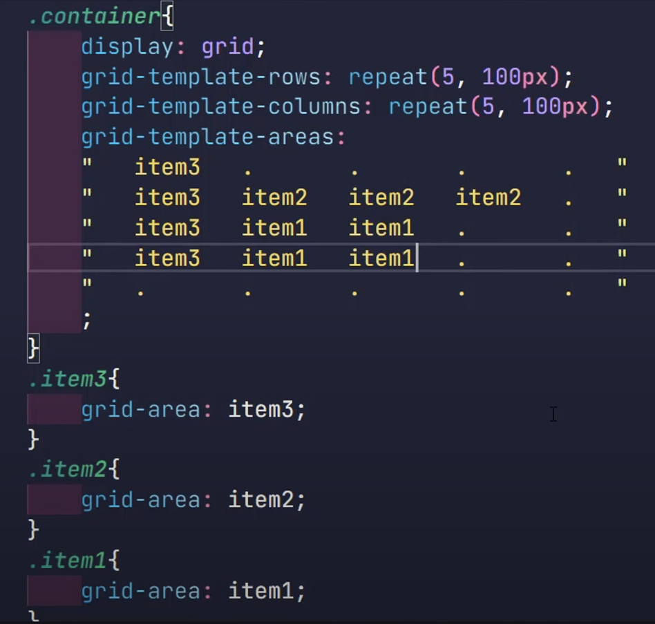

# Previous Notes

### CSS

em for italics

strong for bold

[colorhunt.co](http://colorhunt.co)

there exists some default css

height element is there

specifying percentages is better

```css
hr{
	border-style: none;
	border-top-style: dotted;
	width: 30%;
}
```

### Display Property

block elements

covers the entire region of the screen

p,div, h

inline block elements

covers only what is needed

span, img, a

inline

is inline but you cannot get to set the width

none

they are just not there

you can use visibility in css for the same

### Positioning

Relative

Adding a margin Relative to where the contents were originally

Absolute

Adding a margin Relative to the parent

does affect the flow of your HTML

Parent relative div and child in absolute div

Fixed

Jahan hain vahi rahega

### Centering

Text Align- to centre has to be set inside the parent

centres everything that has a width set

or else neeche wala

Margin: 0 auto 0 auto

0 auto

EM is the width of the capital letter M or 16px;

90px= 5.625em

em is added up same with percentages

you can use rem without worrying about the percentages

float only to be used for wrapping text around and not for positioning

[UI-patterns.com](http://UI-patterns.com)

dribble

sneakpeekit

balsamiq

fontawesome

[t](http://www.w3.org/2000/svg)ry to add in parent as much as possible

z index only works if you have a position attribute

@media print{}

### ReFactoring

Readability

Modularity

Structure in HTML and style in CSS

Efficiency

Length

Use IDs very very sparingly

where they are needed and

for sections

Custom classes should have a singular name

Never Use inline styles

## Intro To WebDesign

You only have 3 seconds to impress

Color Theory

UI Design

Typography

UX Design

### Color Theory

Red- Love, Energy, Intensity

Yellow- Joy Intellect Attention

Green- Freshness Safety Growth

Blue - Stability, Trust, Serenity

Purple- Royalty Wealth Femininity

Analogous Colors-

Colors that are beside each other, they are really good for navigation bar, logo design and footer

Complimentary Color Palette -

Creates a pop

DO NOT STYLE texts or texts background with it

Make it based on geometry

[colorhunt.co](http://colorhunt.co)

### Typography

Difference between the thickest part of the letter and the thinnest part of the letter

Serif-

Traditional Stable Respectable

Sans-Serif-

Sensible Simple Straightforward

Script-

Personal Creative Elegant

Display-

Friendly Loud Amusing

Modern-

Stylish Chic Smart

Humanist- more readable.. sans-serif are usually more readable

* Open shapes
* Ample character spacing
* Unambiguous forms
* Varying Proportions

stick to two fonts

### UI Design

Use colors to make an attention heirarchy

Aim for 40-60 characters per line

Have same alignment.. and reduce the number of alignment points

inject white spaces - make it neat and clean

Design for the audience

### UX Design

* Simplicity
* Consistency
  * F Layout
  * Z Layout
* All Platforn Design
* Dont use your powers of evil

Daily UI

Collect UI

[Canva.com](http://Canva.com)

# FLEXBOX

- For align items to work, you need to have a height property
- won't work if flex-wrap is set to wrap
- `align-content` is similar to `align-items` but only works when you have set the `flex-wrap : wrap;`
- max-width/max-height> flex-basis > width > content width

# Grid

## grid-template-area

- give each item a value of `grid-area: itemNo` and then create a grid from dots in grid-template-area and position them

  
- use `grid-template-columns : repeat(auto-fil, sizeOfColumn)` to automatically adjust the amount of columns to show based on the screen size -> leads to responsive design.
-
